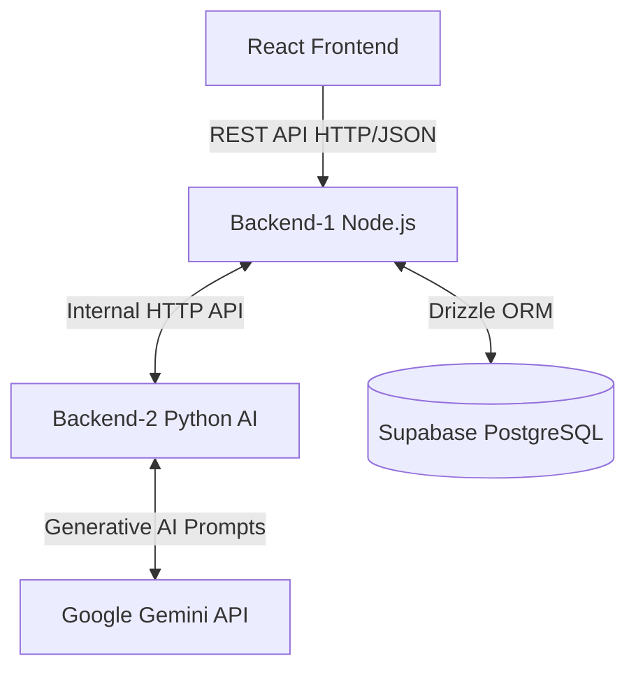

# RecruitAI - Project Architecture & Documentation

This document serves as a comprehensive reference guide to the RecruitAI (Nexus-Project) architecture, folder structure, and key responsibilities of each module. This is designed to help you quickly onboard new developers or explain the project structure seamlessly.

---

## 1. High-Level Architecture

RecruitAI is a robust **3-tier application** split into a React Frontend, a Node.js Main Backend, and a Python AI Microservice.

1. **Frontend (React/Vite)**: The user interface serving two completely different personas: Candidates (Job Portal) and Admins (Dashboard/Recruiting). 
2. **Backend-1 (Node.js/Express)**: The primary API server. It handles authentication (JWT), database operations (Drizzle ORM), job management, and routes candidate applications.
3. **Backend-2 (Python/Flask)**: The AI Microservice. It is isolated to handle heavy machine learning tasks. It securely parses resumes, leverages Google Gemini to score candidates against job prompts, and returns structured JSON to Backend-1.
4. **Database (Supabase)**: A remote PostgreSQL database storing all relations (Admins, Roles, Jobs, Students, Shortlisted Candidates).

---

## 2. Directory Structure

### `Frontend/`
The React application built with Vite and TailwindCSS.
- **`src/api/`**: Contains `apiClient.js` which is the central hub for all network requests to Backend-1. It abstracts away `fetch` logic.
- **`src/components/`**: Reusable UI blocks like `Navbar.jsx`, `JobRow.jsx`, and `CandidateRow.jsx`.
- **`src/pages/`**: Full-page views like `AdminDashboard.jsx`, `JobDetail.jsx`, and `CareerPortal.jsx`.
- **`src/utils/`**: Helper hooks like `useApi.js` (for managing loading/error states during fetch) and `format.js` for date formatting.

### `Backend/Backend-1/`
The Node.js Express server.
- **`src/config/`**: Database connection (`db.js`) and environment variables.
- **`src/controllers/`**: The HTTP layer. Receives requests, calls the appropriate service, and sends JSON responses back to the frontend. (e.g., `jobs.controller.js`).
- **`src/middleware/`**: Interceptors for security, such as `auth.js` (verifying JWT tokens) and `authorize.js` (Role-Based Access Control).
- **`src/routes/`**: Express routers mapping endpoints (e.g., `/api/v1/jobs`) to their controllers.
- **`src/services/`**: The core business logic layer. Files like `students.service.js` handle duplicate checks, saving data, and forwarding resumes to Backend-2.
- **`src/db/schema/`**: Drizzle ORM table definitions (`jobs.js`, `students.js`, `admin.js`). Defines how the SQL tables look in Javascript.
- **`src/db/seed.js`**: A script to easily populate the database with default roles, the Super Admin, and mock jobs.

### `Backend/Backend-2/`
The Python Flask AI microservice.
- **`run.py`**: The entry point that boots up the Flask server on port 5001.
- **`app/routes/`**: Flask Blueprints mapping Python routes (e.g. `/api/v1/resume/parse`).
- **`app/services/`**: Python business logic. This is where `resume_service.py` connects to the `google.generativeai` SDK, constructs the prompt, and extracts ATS scores and skills.
- **`app/schemas/`**: Marshmallow schemas to strictly validate incoming requests from Backend-1 before processing them.

---

## 3. Key Workflows & Files to Know

### A Candidate Applies to a Job
1. **Frontend**: Candidate fills out form in `Apply.jsx` and clicks submit. `apiClient.submitApplication` sends FormData to Backend-1.
2. **Backend-1**: `students.routes.js` routes to `submitApplication` in `students.service.js`.
3. **Backend-1 Service**: Validates the job is open, checks for duplicates, and then makes a synchronous internal HTTP request to Backend-2's `/api/v1/resume/parse`.
4. **Backend-2**: `resume_routes.py` receives the PDF. It uses the Gemini 2.5-flash model to read the PDF text, compares it against the job's `evaluation_prompt`, and returns a score and parsed JSON.
5. **Backend-1 Service**: Receives the AI score, saves the candidate to the `students` table via Drizzle, and returns success to the Frontend.

### Role-Based Access Control (RBAC)
> [!IMPORTANT]
> Security is enforced at the middleware layer in Backend-1.

- **`src/middleware/authorize.js`**: Contains logic to check `req.user.role_key`. 
- Jobs can only be created, updated, or deleted by a **Super Admin (R001)**, **HR Manager (R002)**, or **Hiring Manager (R003)**. 
- Viewers (R004) can only read data.

### Database Cascading Deletions
As implemented recently, when an Admin deletes a job in `jobs.service.js`, the service performs a manual cascading delete. It first scrubs the `shortlisted_students` table for any candidates linked to the job, then deletes the `students` application records, and finally removes the job posting to prevent foreign-key constraint crashes.
